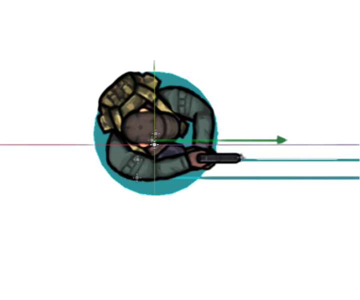
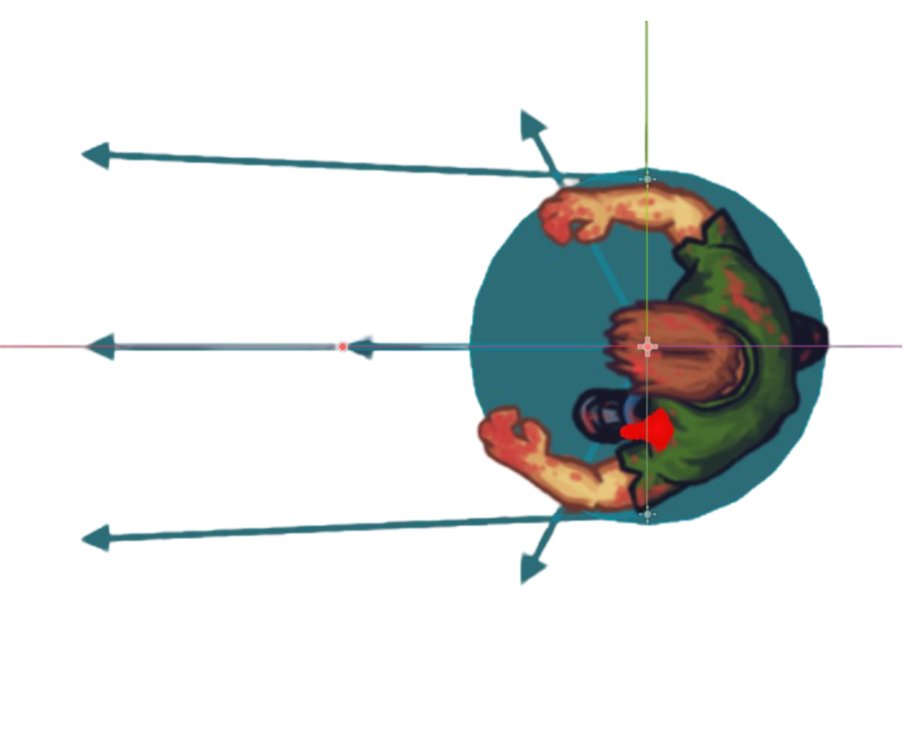
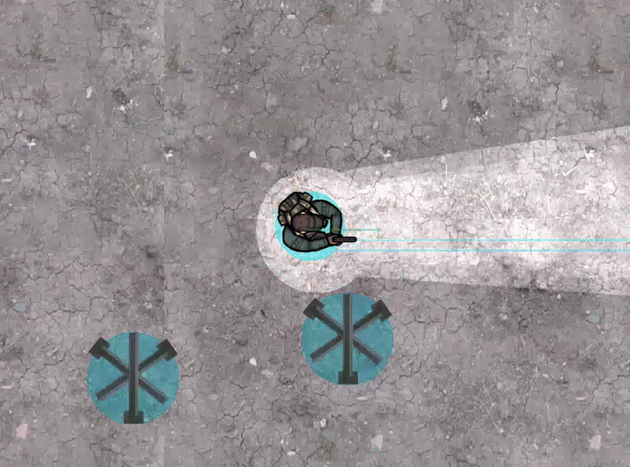

# Deep Reinforcement Learning for my Game Enemy AI
### Author: Daniil Karzanov

This post shares my approach to training AI for enemy behavior in my Android game, covering the results, attempts, and challenges encountered.  
**Note**: The game is currently in closed testing and will be published on Google Play soon. If you’re interested in becoming a tester, feel free to contact me. Meanwhile, check out the [TRAILER VIDEO](https://youtu.be/o0IWvtH6mIU)!

---

### Overview
The player's objective is to survive as many enemy waves as possible by eliminating attacking bots. To enhance gameplay, I decided to replace hard-coded logic with a Deep Reinforcement Learning (DRL) model, allowing the agent to adapt its actions based on observations. Here's a summary of the key behaviors the AI is trained to exhibit:
- Approach the player to engage in combat.
- Avoid the player's flashlight, as the game occurs in darkness with limited visibility.
- Navigate around obstacles effectively.

Inspired by Hierarchical Reinforcement Learning, each of these tasks is targeted separately, with weights from each completed task used to build up the next.

### Technical Details

The game is developed using [Godot 4 Engine](https://godotengine.org/) with the ```godot_rl_agents``` package to enable communication between the engine and Python. The model is based on PyTorch and `stable_baselines3`, with PPO performing best in this setup.

#### Action Space
The AI agent outputs a continuous 2-dimensional vector indicating movement direction, normalized to a unit vector within the game environment.

#### Observation Space
Observations include:
- The direction and distance to the player, normalized for better generalization.
- Current movement direction (`x` and `y` coordinates) to help the agent understand its rotation and orientation.
- Player’s torch direction to avoid being within its light range.

For obstacle navigation, the agent uses three short rays to detect nearby collisions and three long rays pointing forward to "see" objects at a distance.

<div>
  
  
</div>

#### Early Experiments
I initially experimented with a minimal observation space, combining vision and collision ray information with one-hot encoding. However, balancing these indicators proved challenging.

---

### Reward Structure
Each episode starts with random placement of the player and obstacles (0-3 obstacles per episode). If the agent strays too far or fails to reach the player within 15 seconds, the episode restarts. Proximity to the player pauses the timer, encouraging close engagement.

Each in-game element has a `_physics_process` function, updated every frame, where rewards or penalties are applied based on the agent's actions. Rewards are structured as follows:

#### Positive Rewards
- **Approaching the Player**: Reward proportional to distance reduction:  
  ```reward += 0.01 * (old_distance - current_distance)``` (if positive).
- **Player Visibility**: Small reward if the long (central) vision ray detects the player:  
  ```reward += 1```.
- **Unstuck Reward**: Minor reward (`0.1`) each frame to encourage breaking free from obstacles without exploiting the reward.
- **Attack Success**: When in close proximity, the agent activates a damage indicator. Each frame while attacking, the agent receives a reward proportional to damage dealt (`reward += damage_made * 50`). Defeating the player yields a large bonus (`reward += 300`), then the episode restarts.

#### Penalties
Penalties discourage unwanted behaviors:
- **Out of Range**: Penalty if the agent is too far from the player (`reward -= 300`) plus a multiple based on repeated violations.
- **Timeout**: Incurs a penalty if the agent fails to reach the player in time.
- **Collision with Obstacles**: Penalty for each frame of collision, increasing with `iterations_stuck`:  
  ```reward -= 1 * iterations_stuck```.

<div>
  
</div>

---

### Additional Notes
- Lowering the learning rate reduced the agent’s tendency to get stuck on obstacles.
- Penalties for exiting the play area need fine-tuning; some experiments resulted in the agent “escaping” rather than colliding with obstacles.
- Scaling rewards to the range [-1, 1] may be beneficial for stability.


